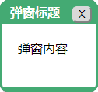

leo-dialog
==========

示例
----
<ClientOnly>
  <labs-leo-dialog/>
</ClientOnly>

说明
----
对话框。




代码
----

```vue
<template>
  <div>
    <leo-dialog :visible="visible" :title="title" @close="close">
      <div class="main">{{content}}</div>
    </leo-dialog>
    <div>
      <label for="title">标题</label>
      <input type="text" name="title" v-model="title">
    </div>
    <div>
      <label for="content">内容</label>
      <input type="text" name="content" v-model="content">
    </div>
    <button @click="open">开启对话框</button>
  </div>
</template>

<script>
import { LeoDialog } from '@axolo/leovue'
export default {
  components: { LeoDialog },
  data() {
    return {
      title: 'Hello',
      content: 'LeoVue',
      visible: false
    }
  },
  methods: {
    open() {
      this.visible = true
    },
    close() {
      this.visible = false
    }
  }
}
</script>

<style scoped>
  div {
    margin: 5px;
  }
</style>
```

属性
----
|  名称   |  类型   |  说明  | 默认值 | 必填 |
| ------- | ------- | ------ | ------ | ---- |
| title   | String  | 标题   | -      |      |
| visible | Blooean | 可见性 | -      |      |


事件
----
| 名称  |   值    |             说明              |
| ----- | ------- | ----------------------------- |
| close | `false` | 发送`fasle`给父组件关闭对话框 |
