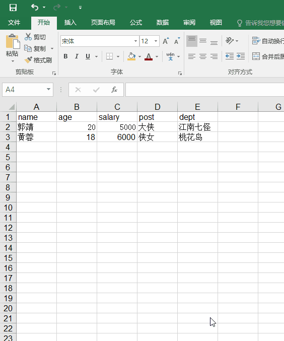

leo-import
==========

示例
----
<labs-leo-import/>

说明
----
Excel格式转JSON。


::: warning 留意
动图演示，导入前10行数据，导入后，表格长度增长了
:::



代码
----
```vue
<template>
  <div id="leo-import">
    <leo-import
      :title="title"
      :visible.sync="visible"
      :template="template"
      @insert="insert">
    </leo-import>
    <button @click="open">导入</button>
    <table>
      <caption>工资表</caption>
      <thead>
        <tr>
          <th>#</th>
          <th>姓名</th>
          <th>年龄</th>
          <th>工资</th>
          <th>岗位</th>
          <th>部门</th>
        </tr>
      </thead>
      <tbody>
        <tr v-for="(item, index) in employees" :key="index">
          <td>{{index+1}}</td>
          <td>{{item.name}}</td>
          <td>{{item.age}}</td>
          <td>{{item.salary}}</td>
          <td>{{item.post}}</td>
          <td>{{item.dept}}</td>
        </tr>
      </tbody>
      <tfoot>
        <tr>
          <td>月份：</td>
          <td colspan="2">2018年7月</td>
          <td>制表：</td>
          <td colspan="2">张三</td>
        </tr>
      </tfoot>
    </table>
  </div>
</template>

<script>
import { LeoImport } from '@axolo/leovue'
export default {
  components: { LeoImport },
  data() {
    return {
      title: '导入工资表',
      visible: false,
      template: '/leovue/static/import/employees.xls',
      data: '',
      employees: [
        { name: '张三', age: 28, salary: 4500, post: '专员', dept: '行政' },
        { name: '李四', age: 30, salary: 5300, post: '设计师', dept: '设计' },
        { name: '王五', age: 29, salary: 4200, post: '前台', dept: '行政' },
        { name: '麻六', age: 25, salary: 4600, post: '专员', dept: '行政' },
        { name: '吴七', age: 24, salary: 4400, post: '专员', dept: '设计' },
        { name: '赵钱孙', age: 28, salary: 5200, post: '设计师', dept: '设计' },
        { name: '郭巨侠', age: 31, salary: 6100, post: '经理', dept: '行政' },
        { name: '李大嘴', age: 36, salary: 8000, post: '总经理', dept: '行政' },
        { name: '钱贵', age: 27, salary: 3900, post: '专员', dept: '设计' },
        { name: '孙无忌', age: 26, salary: 5400, post: '主管', dept: '行政' }
      ]
    }
  },
  methods: {
    open() {
      this.visible = true
    },
    insert(data) {
      this.employees = this.employees.concat(data)
    }
  }
}
</script>

<style scoped>
#leo-import {
  margin: 5px;
}
</style>
```

属性
----
|   名称   |  类型   |       说明       |     默认值     | 必填 |
| -------- | ------- | ---------------- | -------------- | ---- |
| title    | String  | 标题             |                |      |
| visible  | Boolean | 对话框可见性     |                |      |
| template | String  | 模板文件下载路径 |                |      |
| type     | Array   | 允许的文件类型   | xls, csv, xlsx |      |

方法
----
|  名称  |      值      |            说明            |
| ------ | ------------ | -------------------------- |
| insert | 被导入的数据 | 发送导入的数据供父组件处理 |
