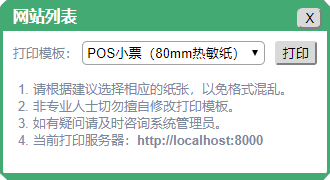

leo-lodop
=========

说明
----
调用LODOP打印。[LODOP演示及文档](http://www.lodop.net/LodopDemo.html)细节不够完美，需要自行测试。如：
- HTM格式：矢量打印，文字非常清晰
- HTML格式：整个文档转换为低画质图片后打印 :(

#### 前提条件
- [LODOP](http://www.lodop.net/)
- [Lodash](https://www.lodashjs.com/)
- [doT.js](https://github.com/defunkt/dotjs)
- [axios](https://github.com/axios/axios)

#### 模板选择对话框


#### 打印预览


代码
----

```vue
<template>
  <div>
    <button @click="print">leo-lodop打印</button>
    <leo-lodop
      :visible.sync="visible"
      :title="'网站列表'"
      :data="data"
      :templates="templates">
    </leo-lodop>
  </div>
</template>

<script>
import LeoLodop from '@axolo/leovue'
export default {
  components: { LeoLodop },
  data() { return {
    visible: false,
    data: [
      { id: 1, name: '西阁码农', site: 'www.woodso.com' },
      { id: 2, name: 'Vue.js',   site: 'cn.vuejs.org'   },
      { id: 3, name: 'GitHub',   site: 'www.github.com' }
    ],
    templates: [{
      "id": 1,
      "label": "accounts",
      "name": "A4竖版",
      "bio": "自适应纸张",
      "url": "/static/lodop/site-a4.html",
      "engine": "dot",
      "format": "TABLE",
      "params": {
        "left": "7.5%",
        "top": "7.5%",
        "right": "RightMargin:7.5%",
        "bottom": "BottomMargin:7.5%"
      },
      "default": false
    }, {
      "id": 2,
      "label": "accounts",
      "name": "POS小票",
      "bio": "80mm热敏纸",
      "url": "/static/lodop/site-80mm.html",
      "engine": "dot",
      "format": "HTM",
      "params": {
        "left": "5%",
        "top": "1.0cm",
        "right": "RightMargin:5%",
        "bottom": "BottomMargin:1.0cm"
      },
      "default": true
    }]
  }},
  methods: {
    print() {
      this.visible = true
    }
  }
}
</script>

```

```html
<!-- site-80mm.html (HTML with doT.js Template) -->
<style>
  .label { font-weight: bold; }
  .label:after { content: '：'; }
  .main { font-size: small; margin-bottom: 10; }
  h4 { margin: 5 0; }
  hr { border: 1px dashed darkgray; }
</style>
<h4>网站列表</h4>
<hr>
<div class="main">{{~it:v:i}}
  <div>
    <span class="label">序号</span>
    <span class="content">{{=v.id}}</span>
  </div>
  <div>
    <span class="label">名称</span>
    <span class="content">{{=v.name}}</span>
  </div>
  <div>
    <span class="label">网址</span>
    <span class="content">{{=v.site}}</span>
  </div>
  </div>
  <hr>{{~}}
</div>
<div>制表：</div>

```

属性
----
|   名称    |                     说明                      |
| --------- | --------------------------------------------- |
| visible   | 可见性                                        |
| title     | 标题                                          |
| data      | 需要打印的数据                                |
| templates | 打印模板列表                                  |
| server    | 指定打印服务器，默认：`http://localhost:8000` |


方法
----
无。
