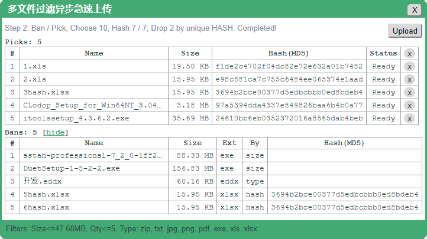
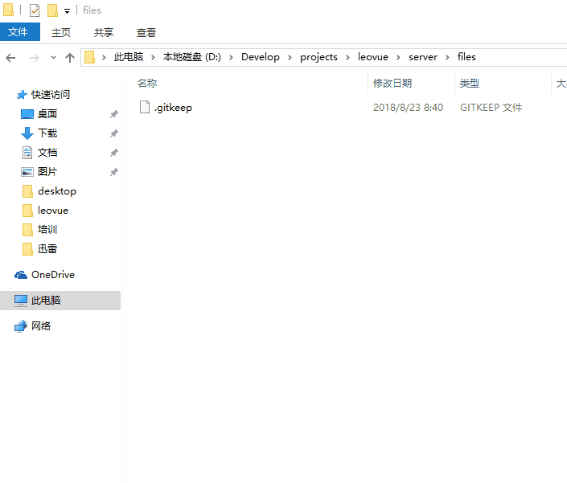

leo-upload
==========

示例
----
<ClientOnly>
  <labs-leo-upload/>
</ClientOnly>

说明
----
多文件可控制急速异步文件上传。尽量避免占用服务器资源，最大限度利用服务器已有资源，
纯客户端实现哈希计算，绿色环保。解耦设计，不过分依赖服务器数据结构。





代码
----
```vue
<template>
  <div>
    <leo-upload
      :title="title"
      :visible.sync="visible"
      :types="types"
      :size="size"
      :max="10"
      :multiple="true"
      :action="action"
      :rapid="rapid"
      @result="result">
    </leo-upload>
    <h4>文件上传与服务器配置和返回密切相关，参数务必配合服务器</h4>
    <div class="input">
      <label for="action">文件上传地址：</label>
      <input type="text" class="url" name="action" v-model="action.url">
    </div>
    <div class="input">
      <label for="action_hash_path">上传验证键址：</label>
      <input type="text" class="url" name="action_hash_path" v-model="action.hash_path">
    </div>
    <div class="tip">
      若，上传成功返回：
      <code>{"data":[{"md5":"25feb93e5e1b18f5596f384f214b1242"}]}</code><br>
      则，<code>action.hash_path</code>对应为<code>data[0].md5</code><br>
      强烈建议服务器端再次验证本地hash，以防客户端伪装欺骗！！！
    </div>
    <hr>
    <div class="input">
      <label for="rapid">急速验证地址：</label>
      <input type="text" class="url" name="rapid" v-model="rapid.url">
      <div class="tip">
        <code>%%hash_value%%</code>占位符代表验证地址中的HASH字串</code>，提交时被替换
      </div>
    </div>
    <div class="input">
      <label for="rapid_hash_path">急速返回键址：</label>
      <input type="text" class="url" name="rapid_hash_path" v-model="rapid.hash_path">
      <div class="tip">
        若，验证成功返回：
        <code>{"data":[{"md5":"25feb93e5e1b18f5596f384f214b1242"}]}</code><br>
        则，<code>rapid.hash_path</code>对应为<code>data[0].md5</code><br>
        本示例配合本文档的 <a href="#服务器">服务器</a> 代码实现，请留意本示例的参数设置
      </div>
    </div>
    <hr>
    <div class="input">
      <button @click="open">上传</button>
      <button @click="clear" v-if="files.length">清除MD5列表</button>
    </div>
    <ol v-if="files.length" class="file-list">上传成功的文件MD5列表
      <li v-for="(file,index) in files" :key="index">
        <a :href="'http://localhost:7001/files/'+file.md5" target="_blank">
          {{file.md5}}
        </a>
      </li>
    </ol>
  </div>
</template>

<script>
import { LeoUpload } from '@axolo/leovue'
export default {
  components: { LeoUpload },
  data() {
    return {
      files: [],
      title: '多文件过滤异步急速上传',
      visible: false,
      size: 5 * 1024 * 1024 * 1024,  // 500MB
      types: ['zip', 'txt', 'csv', 'jpg', 'png', 'pdf', 'exe', 'xls', 'xlsx', 'iso'],
      action: {
        method: 'POST',
        url: 'http://localhost:7001/files',
        hash_path: 'md5'
      },
      rapid: {
        method: 'GET',
        url: 'http://localhost:7001/files/%%hash_value%%',
        hash_path: 'md5'
      }
    }
  },
  methods: {
    result(res) {
      this.files = res
    },
    open() {
      this.visible = true
    },
    clear() {
      this.files = []
    }
  }
}
</script>

<style scoped>
#leo-upload {
  margin: 5px;
}
.input {
  margin-bottom: 5px;
}
.url {
  width: 300px;
}
.tip {
  font-size: small;
  color: darkcyan;
}
.file-list {
  font-family: 'Courier New', Courier, monospace;
  font-size: small;
}
code {
  padding: 0 5px;
}
</style>
```


属性
----
|   名称   |  类型   |        说明        |     默认值     | 必填 |
| -------- | ------- | ------------------ | -------------- | ---- |
| title    | String  | 对话框标题         |                |      |
| visible  | Boolean | 对话框可见性       |                |      |
| types    | Array   | 文件格式           | [] = 不限制    |      |
| size     | Number  | 单文件最大尺寸限制 | 0 = 不限制     |      |
| max      | Number  | 最大文件总量       | 0 = 不限制     |      |
| multiple | Boolean | 允许多文件上传     | true = 允许    |      |
| action   | Object  | 上传地址参数       |                |      |
| rapid    | Object  | 启用急传参数       | false = 不启用 |      |

::: tip action和rapid
- `%%hash_value%%`: 占位符，对应被验证的哈希值
- `hash_path`：被验证的哈希值在验证返回数据里的位置
:::

::: danger 服务器限制
请注意，服务器也会对文件上传的格式、大小、数量等做限制，请务必跟服务器配合。
避免出现显示上传成功，但服务器却没有接受文件或更新对应数据的情况发生。
:::


事件
----
|  名称  |  值   |                   说明                   |
| ------ | ----- | ---------------------------------------- |
| result | Array | 上传成功的返回数据（其格式由服务器决定） |


服务器
------
文件上传功能必须搭配能处理文件上传的服务器使用，理论上，任何支持文件上传功能的服务器都可以。
若开启急速上传，需要服务器支持`MD5`验证，且符合相应数据格式。本文以[Egg.js](https://eggjs.org/zh-cn/)作为服务器实现，
`Egg.js`默认内置了[egg-multipart](https://eggjs.org/zh-cn/plugins/multipart.html)插件用于处理文件上传。

#### 安装
```bash
# 1. egg.js 安装
npm i egg-init -g
egg-init file-server --type=simple
cd file-server
npm i
npm run dev
open localhost:7001
```

#### 配置
```js
// 2. config/plugin.js 安装egg-cors，并开启
exports.cors = {
  enable: true,
  package: 'egg-cors'
}
```

```js
// config/config.default.js
// 3. 简单起见，直接关闭CSRF，否则发起非GET请求报CSRF错误
config.security = { csrf: { enable: false }}
// 4. 开启跨域，egg-cors为非内置插件，已在plugin.js里面开启
config.cors = {
  origin: '*',
  allowMethods: 'GET,HEAD,PUT,POST,DELETE,PATCH'
}
// 5. egg-multipart参数设置
config.multipart = {
  fileSize: '5000mb',
  fileExtensions: ['.xls','.xlsx','.txt', '.pdf' ]
}
```

#### 实现

```js
// app/controller/files.js
const path = require('path')
const fs = require('fs')
const _ = require('lodash')
const crypto = require('crypto')
const sendToWormhole = require('stream-wormhole')
const awaitReadStream = require('await-stream-ready').read
const Controller = require('egg').Controller

class FilesController extends Controller {
  constructor(ctx) {
    super(ctx)    
    this.files = [  // 测试用数据，实际应用应该结合 service 和数据库
      { "md5": "808e3dbe48915685d1597c7b789888d8" },
      { "md5": "aae7f6464638dec6616489ef5bd404bb" },
      { "md5": "25feb93e5e1b18f5596f384f214b1242" },
      { "md5": "6fdf1caf3f77017f5a6622c133dafbc7" },  // FoxitPhantom224cn.exe
      { "md5": "e922301da3512247ab71407096ab7810" }   // HashCalc.exe
    ]
  }

  async index() {
    this.ctx.body = this.files
  }

  async show() {
    let file = _.find(this.files, { "md5": this.ctx.params.id })
    this.ctx.body = file ? file : { "error": 404 }
  }

  // 此处为简单测试，不考虑文件夹逻辑，简单粗暴的放在固定目录下，也不考虑后台操作失败处理。
  // 请注意新建 files 和 tmp 目录后运行代码，否则404。请留意 .gitignore 配置。
  async create() {
    const { ctx } = this
    const rs = await ctx.getFileStream()
    const dir = fs.mkdtempSync('tmp/leovue-')
    const tmp = path.join(dir, rs.filename)
    const ws = fs.createWriteStream(tmp)
    const hash = crypto.createHash('md5')
    rs.on('data', chunk => { hash.update(chunk) && ws.write(chunk) })
    rs.on('end', () => { ws.end() })
    rs.on('error', () => { sendToWormhole(rs) && console.log(err) })
    await awaitReadStream(rs)           // 你走，我断后！！！
    const md5 = hash.digest('hex')      // MD5可以在 on end 里计算
    ctx.body = { md5: md5 }             // 输出到前端，后端继续执行（非主流）
    const fix = path.join('files', md5 + path.extname(rs.filename).toLocaleLowerCase())
    fs.rename(tmp, fix, (err) => { err && console.log(err) || fs.rmdir(dir) }) // 后端继续
  }
}
module.exports = FilesController
```

```js
// app/router.js 开启路由
router.resources('files', '/files', controller.files)
```
